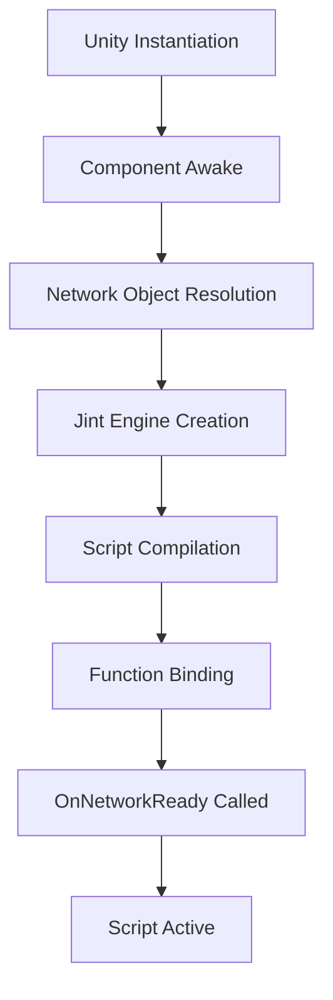
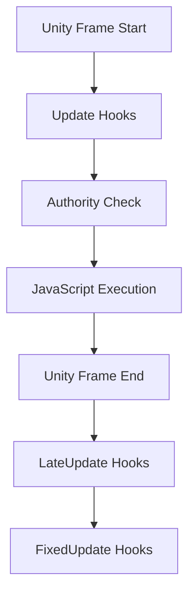

# MetaverseScript Authoring and Integration Guide

This comprehensive guide equips both automated agents and human developers with the knowledge required to write, wire, and debug JavaScript that runs inside the MetaverseScript component powered by the Jint engine in Unity. This document serves as the authoritative reference for MetaverseScript development, covering everything from basic concepts to advanced networking patterns.

---

## Table of Contents

### Part 1: Core Concepts & Architecture
1. MetaverseScript Architecture & Design Philosophy
2. Runtime Environment & Sandbox Security
3. Lifecycle Management & Execution Flow
4. API Surface & Global Objects

### Part 2: Development Fundamentals
5. Coding Conventions & Best Practices
6. Variables & Data Binding Patterns
7. Cross-Script Communication & Component Resolution
8. Error Handling & Diagnostic Strategies

### Part 3: Unity Integration
9. UnityEvent Integration & Parameter Types
10. Visual Scripting Variables Integration
11. Scene & Prefab Integration Patterns
12. YAML Serialization & Asset Management

### Part 4: Advanced Features
13. Networking & RPC Systems
14. Asynchronous Programming Patterns
15. Custom UnityEvent Types & Type Safety
16. Performance Optimization Techniques

### Part 5: Real-World Examples
17. Complete Game Systems Examples
18. Multiplayer Game Mechanics
19. UI & Interaction Systems
20. Asset Management & Loading

### Part 6: Development Workflow
21. Editor Integration & Custom Tools
22. Git Workflow & Version Control
23. Pre-Deployment Validation
24. Troubleshooting & Common Issues

### Appendices
A. Frequently Used Code Snippets
B. API Reference & Type Mappings
C. Blacklist & Whitelist Reference
D. Performance Benchmarks & Metrics
E. Migration Guides & Breaking Changes

---

---

## Part 1: Core Concepts & Architecture

### 1. MetaverseScript Architecture & Design Philosophy

MetaverseScript represents a paradigm shift in Unity scripting, bridging the gap between Unity's C# ecosystem and JavaScript's flexibility. It embeds a Jint JavaScript runtime directly within a Unity MonoBehaviour, creating a sandboxed execution environment that maintains Unity's performance characteristics while providing JavaScript's rapid prototyping capabilities.

#### 1.1 Core Architecture Principles

**Hybrid Execution Model**
- **Jint Engine Integration**: Scripts execute within a sandboxed Jint interpreter, providing JavaScript semantics while maintaining Unity's deterministic performance.
- **Unity Lifecycle Compliance**: All scripts respect Unity's standard lifecycle hooks (`Awake`, `Start`, `Update`, etc.) and authority-based execution patterns.
- **Type-Safe Interop**: JavaScript code interacts with Unity APIs through carefully curated type mappings and conversion layers.

**Security-First Design**
- **Assembly Whitelisting**: Only approved Unity and MVCE assemblies are accessible, preventing access to dangerous system APIs.
- **Namespace Restrictions**: Blacklisted namespaces (`System.IO`, `System.Reflection`, etc.) are completely inaccessible.
- **Sandboxed Execution**: Scripts cannot access the file system, network, or other system resources directly.

**Performance Optimization**
- **Function Caching**: JavaScript functions are cached as delegates for repeated invocation.
- **Lazy Loading**: Scripts only compile when first needed, with caching for subsequent loads.
- **Authority Gating**: Network operations respect Unity Netcode's authority system.

#### 1.2 Component Structure

```csharp
[HideMonoScript]
[HelpURL("https://reach-cloud.gitbook.io/reach-explorer-documentation/docs/development-guide/unity-engine-sdk/custom-scripting/custom-javascript")]
[AddComponentMenu(MetaverseConstants.ProductName + "/Scripting/Metaverse Script")]
[ExecuteAlways]
public class MetaverseScript : NetworkObjectBehaviour
{
    // Core execution fields
    [Required] public TextAsset javascriptFile;
    [SerializeField] private TextAsset[] includes = Array.Empty<TextAsset>();
    [SerializeField] private GlobalType`Import`s globalTypeImports = GlobalTypeImports.None;
    [SerializeField] private Variables variables;

    // Networking fields (hidden in inspector)
    [HideInInspector] private bool autoAssignNetworkObject = true;
    [HideInInspector] private NetworkObject networkObject;

    // Runtime state
    private bool _ready;
    private Engine _engine;
    private Dictionary<ScriptFunctions, JsValue> _methods;
    private ConsoleObject _console;
    private ScriptContext _context;
}
```

#### 1.3 Key Serialized Fields

| Field | Type | Purpose | Required |
|-------|------|---------|----------|
| `javascriptFile` | `TextAsset` | The primary JavaScript file to execute | ✅ |
| `includes` | `TextAsset[]` | Dependency scripts loaded before main file | ❌ |
| `globalTypeImports` | `GlobalTypeImports` | Additional .NET namespace access | ❌ |
| `variables` | `Variables` | Visual Scripting variable bindings | ❌ |
| `onInitialize` | `UnityEvent` | Called when script initializes | ❌ |
| `customEvents` | `SerializableUnityEvent[]` | Custom events callable from JavaScript | ❌ |

#### 1.4 Runtime State Management

**Initialization Phases**
1. **Component Attachment**: Unity instantiates the component
2. **Dependency Resolution**: Network object and variable bindings are established
3. **Engine Creation**: Jint engine is configured with allowed assemblies
4. **Script Loading**: JavaScript files are compiled and cached
5. **Function Binding**: Lifecycle functions are resolved and cached
6. **Ready State**: Component becomes active for execution

**Authority System Integration**
- Scripts respect Unity Netcode's authority model
- Only authorized clients execute state-changing logic
- Network operations require proper authority checks

#### 1.5 Execution Context

Each MetaverseScript maintains its own isolated execution context:

- **Global Variables**: Persist across function calls
- **Component References**: Cached Unity component access
- **Network State**: Authority and ownership information
- **Visual Scripting Bindings**: Variable declarations and values

---

## 2. Runtime Environment & Sandbox Security

### 2.1 Jint Sandbox Architecture

MetaverseScript utilizes the Jint JavaScript engine as its core execution environment, providing a secure, performant bridge between JavaScript and Unity's .NET ecosystem.

#### 2.1.1 Execution Model

**Synchronous Execution**
- All JavaScript code executes on Unity's main thread
- No multi-threading or background processing within scripts
- Unity's frame-based update cycle determines execution timing

**Type Conversion Layer**
- Automatic marshaling between JavaScript and .NET types
- Primitive types (int, float, string, bool) convert seamlessly
- Complex Unity types (Vector3, GameObject, etc.) are wrapped appropriately
- Collections and arrays maintain type information

**Memory Management**
- JavaScript objects are garbage collected by Jint's runtime
- Unity object references are managed by Unity's lifecycle
- No direct memory allocation control from JavaScript

#### 2.1.2 Sandbox Security Model

**Assembly Access Control**
```csharp
private static Assembly[] GetAssemblies()
{
    return new[]
    {
        // Core Unity modules
        typeof(GameObject).Assembly,           // UnityEngine.CoreModule
        typeof(Rigidbody).Assembly,           // UnityEngine.PhysicsModule
        typeof(Canvas).Assembly,              // UnityEngine.UI
        typeof(AudioSource).Assembly,         // UnityEngine.AudioModule
        typeof(Animator).Assembly,            // UnityEngine.AnimationModule

        // Extended modules (conditional)
        #if MV_UNITY_AI_NAV
        typeof(NavMesh).Assembly,             // UnityEngine.AIModule
        #endif

        // Third-party integrations
        typeof(TMPro.TextMeshProUGUI).Assembly, // TextMeshPro
        typeof(CinemachineVirtualCamera).Assembly, // Cinemachine

        // MVCE assemblies
        typeof(MetaverseScript).Assembly,
        typeof(NetworkObjectBehaviour).Assembly,

        // Async support
        typeof(UniTask).Assembly,
    };
}
```

**Namespace Restrictions**
- **Allowed**: `UnityEngine`, `UnityEngine.UI`, `UnityEngine.Physics`, etc.
- **Blocked**: `System.IO`, `System.Reflection`, `System.Net`, `Microsoft.*`

**API Blacklist**
```javascript
// ❌ Blocked - Global object discovery
FindObjectOfType, FindObjectsOfType, FindAnyObjectByType

// ❌ Blocked - Direct messaging
SendMessage, BroadcastMessage, SendMessageUpwards

// ❌ Blocked - File system access
PlayerPrefs, Resources, AssetBundle

// ❌ Blocked - Reflection and system access
System.IO.*, System.Reflection.*, System.Web.*
```

#### 2.1.3 Global Object Injection

**Automatically Available Objects**
- `console` - Logging interface
- `transform` - Component's Transform
- `gameObject` - Component's GameObject
- `this` - Reference to the MetaverseScript component

**Import Pattern**
```javascript
// Import Unity namespaces
const UnityEngine = importNamespace("UnityEngine");
const UI = importNamespace("UnityEngine.UI");
const Physics = importNamespace("UnityEngine.Physics");

// Import MVCE namespaces
const MVCE = importNamespace("MetaverseCloudEngine.Unity");

// Access types and static methods
const Vector3 = UnityEngine.Vector3;
const Mathf = UnityEngine.Mathf;
const Button = UI.Button;
const Rigidbody = Physics.Rigidbody;
```

### 2.2 Console & Logging System

#### 2.2.1 Console Object Interface

The `console` object provides familiar browser-style logging with Unity integration:

```javascript
// Standard logging levels
console.log("Player spawned at:", position);     // Info level
console.info("Loading level assets...");         // Info level
console.warn("Low health:", health);             // Warning level
console.error("Failed to load texture:", asset); // Error level
console.debug("Debug info:", debugData);         // Debug level (build-stripped in release)
```

**Log Output Format**
```
[MetaverseScript:MyScript.js] Player spawned at: (10, 5, 0)
[MetaverseScript:MyScript.js] ⚠️ Low health: 15
[MetaverseScript:MyScript.js] ❌ Failed to load texture: missing_asset
```

#### 2.2.2 Log Categories & Filtering

**Unity Console Integration**
- Logs appear in Unity's Console window
- Script name prefix for easy filtering
- Stack traces included for debugging
- Log levels respect Unity's log filtering

**Performance Considerations**
- Console operations are synchronous
- Excessive logging impacts frame rate
- Use conditional logging in performance-critical paths

#### 2.2.3 Custom Logging Utilities

```javascript
// Structured logging helper
function LogWithContext(level, message, context) {
    const contextStr = context ? ` [${JSON.stringify(context)}]` : '';
    console[level](`${message}${contextStr}`);
}

// Usage
LogWithContext('info', 'Player action', { action: 'jump', height: 2.5 });
```

### 2.3 Assembly & Type System

#### 2.3.1 Approved Assemblies

**Core Unity Modules**
- `UnityEngine.CoreModule` - GameObjects, Components, Time, etc.
- `UnityEngine.PhysicsModule` - Rigidbody, Collider, Raycast, etc.
- `UnityEngine.UIModule` - Canvas, Button, Text, Image, etc.
- `UnityEngine.AudioModule` - AudioSource, AudioClip, AudioListener
- `UnityEngine.AnimationModule` - Animator, Animation, AnimationCurve

**Extended Modules (Conditional)**
- `UnityEngine.AIModule` - NavMesh, NavMeshAgent, NavMeshObstacle
- `UnityEngine.XRModule` - XR input and tracking systems
- `UnityEngine.VideoModule` - Video playback capabilities

**Third-Party Integrations**
- `TextMeshPro` - Advanced text rendering
- `Cinemachine` - Camera management and behaviors
- `UniTask` - Async/await support for Unity

#### 2.3.2 Type Resolution & Import

**Namespace Import Syntax**
```javascript
// Single namespace
const UnityEngine = importNamespace("UnityEngine");

// Multiple namespaces
const { Mathf, Vector3, Quaternion } = importNamespace("UnityEngine");
const { Button, Text, Image } = importNamespace("UnityEngine.UI");
```

**Type Access Patterns**
```javascript
// Static methods and properties
const forward = UnityEngine.Vector3.forward;
const distance = UnityEngine.Vector3.Distance(pos1, pos2);
const randomValue = UnityEngine.Random.Range(0, 100);

// Constructor access
const position = new UnityEngine.Vector3(10, 5, 0);
const rotation = new UnityEngine.Quaternion(0, 0, 0, 1);

// Enum access
const layerMask = UnityEngine.LayerMask.GetMask("Player", "Enemy");
```

#### 2.3.3 CLR Write Access

**Allowed Modifications**
- Component field assignment
- Transform property changes
- Collection modifications
- Variable declarations

**Blocked Operations**
- Static field modifications
- System property changes
- Assembly metadata access
- Type system modifications

### 2.4 Performance Characteristics

#### 2.4.1 Execution Performance

**Function Call Overhead**
- Direct function calls: ~0.1-0.5ms
- Cross-script calls: ~0.5-2ms
- Unity API calls: ~0.1-1ms

**Memory Usage**
- Base script: ~2-5MB per instance
- Additional includes: ~0.5-1MB each
- Variable bindings: ~0.1-0.5MB

**Garbage Collection Impact**
- Jint objects are GC-friendly
- Unity object references don't create additional GC pressure
- Avoid creating objects in tight loops

#### 2.4.2 Optimization Guidelines

**Caching Strategy**
```javascript
// ✅ Good - Cache references
let cachedTransform = null;
let cachedRigidbody = null;

function OnNetworkReady() {
    cachedTransform = transform;
    cachedRigidbody = gameObject.GetComponent(UnityEngine.Rigidbody);
}

// ❌ Bad - Repeated lookups
function Update() {
    const rb = gameObject.GetComponent(UnityEngine.Rigidbody);
    rb.AddForce(UnityEngine.Vector3.up);
}
```

**Batch Operations**
```javascript
// ✅ Good - Batch array operations
const positions = [pos1, pos2, pos3];
for (let i = 0; i < positions.length; i++) {
    // Process each position
}

// ❌ Bad - Individual operations
ProcessPosition(pos1);
ProcessPosition(pos2);
ProcessPosition(pos3);
```

**Conditional Execution**
```javascript
// ✅ Good - Authority gating
function Update() {
    if (!GetIsInputAuthority()) return;
    // Only execute on authoritative client
}

// ❌ Bad - Unconditional execution
function Update() {
    // Executes on all clients, wasting resources
}
```

---

## 3. Lifecycle Management & Execution Flow

### 3.1 Unity Lifecycle Integration

MetaverseScript seamlessly integrates with Unity's component lifecycle while maintaining JavaScript execution semantics. Each lifecycle hook maps to corresponding JavaScript functions that are automatically invoked by the runtime.

#### 3.1.1 Lifecycle Hook Mapping

| Unity Hook | JavaScript Function | Purpose | Authority Required |
|------------|-------------------|---------|-------------------|
| `Awake` | `Awake()` | Initial component setup, reference caching | ❌ |
| `OnEnable` | `OnEnable()` | Component activation | ❌ |
| `Start` | `Start()` | Post-initialization setup | ❌ |
| `OnNetworkSpawn` | `OnNetworkSpawn()` | Network object spawned | ✅ |
| `OnNetworkDespawn` | `OnNetworkDespawn()` | Network object despawned | ✅ |
| `OnNetworkReady` | `OnNetworkReady()` | Network & script ready | ✅ |
| `Update` | `Update()` | Per-frame updates | ✅ |
| `LateUpdate` | `LateUpdate()` | Post-physics updates | ✅ |
| `FixedUpdate` | `FixedUpdate()` | Physics timestep updates | ✅ |
| `OnGUI` | `OnGUI()` | IMGUI rendering | ❌ |
| `OnDisable` | `OnDisable()` | Component deactivation | ❌ |
| `OnDestroy` | `OnDestroy()` | Component destruction | ❌ |

**Authority Requirements**
- ✅ **Required**: Only executes on authoritative clients
- ❌ **Not Required**: Executes on all clients

#### 3.1.2 Execution Order & Timing

**Initialization Sequence**


**Frame Execution**


### 3.2 Authority System Integration

#### 3.2.1 Authority Types

**Input Authority**
- Controls user input and local state
- Typically the owning client
- Can send input to state authority

**State Authority**
- Controls authoritative game state
- Usually the server or host
- Validates and applies state changes

**Observer Authority**
- Read-only access to state
- Non-owning clients
- Receives state updates

#### 3.2.2 Authority Checking Functions

```javascript
// Authority verification helpers
const isInputAuthority = GetIsInputAuthority();    // Input control
const isStateAuthority = GetIsStateAuthority();    // State control
const isOwner = GetIsOwner();                      // Object ownership
const hostId = GetHostID();                        // Host client ID

// Usage patterns
function Update() {
    // Only process input on input authority
    if (!GetIsInputAuthority()) {
        return;
    }

    // Process local input and send to state authority
    const inputData = ProcessLocalInput();
    if (isInputAuthority && !isStateAuthority) {
        ServerRPC(RPC.UpdatePlayerInput, inputData);
    }
}

function OnPlayerInputRPC(rpcId, senderId, inputData) {
    // Only state authority processes input
    if (!GetIsStateAuthority()) {
        return;
    }

    // Validate and apply input
    ValidateAndApplyInput(inputData);
    ClientRPC(RPC.PlayerStateUpdate, GetPlayerState());
}
```

### 3.3 Network State Management

#### 3.3.1 Network Object Lifecycle

**Spawn Process**
```javascript
function OnNetworkSpawn() {
    // Network object is now active
    console.log("Player spawned with network ID:", NetworkID);

    // Initialize networked components
    InitializeNetworkedComponents();

    // Register for network events
    RegisterNetworkEventHandlers();
}

function OnNetworkDespawn() {
    // Network object is being destroyed
    console.log("Player despawned");

    // Cleanup network resources
    CleanupNetworkResources();

    // Unregister event handlers
    UnregisterNetworkEventHandlers();
}
```

**Ready State**
```javascript
function OnNetworkReady() {
    // Both network and script are ready
    console.log("Network and script initialized");

    // Safe to access network properties
    const networkObject = GetNetworkObject();
    const isHost = GetHostID() === -1;

    // Initialize game state
    InitializePlayerState();
}
```

#### 3.3.2 Network Object Properties

**Available Properties**
- `NetworkID` - Unique network identifier
- `IsSpawned` - Whether object is networked
- `IsOwner` - Local ownership status
- `IsInputAuthority` - Input control authority
- `IsStateAuthority` - State authority control

### 3.4 Function Caching & Performance

#### 3.4.1 Function Resolution Strategy

**Static Function Binding**
- Lifecycle functions are resolved once at startup
- Cached as delegates for repeated invocation
- Performance optimized for frequent calls

**Dynamic Function Resolution**
- `ExecuteVoid` and `Execute` resolve functions at runtime
- Slower but more flexible for dynamic scenarios
- Useful for event-driven systems

#### 3.4.2 Caching Best Practices

**Component References**
```javascript
// ✅ Good - Cache in OnNetworkReady
let cachedTransform = null;
let cachedRigidbody = null;
let cachedAnimator = null;

function OnNetworkReady() {
    cachedTransform = transform;
    cachedRigidbody = gameObject.GetComponent(UnityEngine.Rigidbody);
    cachedAnimator = gameObject.GetComponent(UnityEngine.Animator);
}

// Use cached references in Update
function Update() {
    if (!GetIsInputAuthority()) return;

    const velocity = cachedRigidbody.velocity;
    const speed = velocity.magnitude;

    if (speed > maxSpeed) {
        cachedRigidbody.velocity = velocity.normalized * maxSpeed;
    }
}
```

**Collection Caching**
```javascript
// ✅ Good - Cache collections
let waypointTransforms = null;

function CacheWaypoints() {
    const waypointParent = gameObject.Find("Waypoints");
    if (waypointParent) {
        waypointTransforms = [];
        for (let i = 0; i < waypointParent.childCount; i++) {
            waypointTransforms.push(waypointParent.GetChild(i));
        }
    }
}

// ❌ Bad - Recreate collections every frame
function Update() {
    const waypoints = [];
    // ... populate waypoints every frame
}
```

### 3.5 Error Handling & Recovery

#### 3.5.1 Exception Handling Patterns

**Try-Catch in Lifecycle Functions**
```javascript
function Update() {
    try {
        if (!GetIsInputAuthority()) return;

        // Game logic here
        UpdatePlayerMovement();
        CheckCollisions();

    } catch (error) {
        console.error("Error in Update:", error);
        // Attempt recovery or disable component
        if (ShouldDisableOnError()) {
            enabled = false;
        }
    }
}
```

**Graceful Degradation**
```javascript
function InitializePlayer() {
    try {
        LoadPlayerModel();
        SetupAnimations();
        InitializeWeapons();

    } catch (error) {
        console.warn("Player initialization failed:", error);

        // Fall back to default state
        LoadDefaultPlayerModel();
        SetupBasicAnimations();
    }
}
```

#### 3.5.2 Debugging & Diagnostics

**Conditional Debugging**
```javascript
const DEBUG_MODE = false; // Set to true for development builds

function DebugLog(message, data) {
    if (DEBUG_MODE) {
        console.log(message, data);
    }
}

// Usage
DebugLog("Player position:", transform.position);
```

**Performance Monitoring**
```javascript
let frameCount = 0;
let lastFpsCheck = 0;

function Update() {
    frameCount++;

    // Check FPS every second
    if (UnityEngine.Time.time - lastFpsCheck > 1.0) {
        const fps = frameCount / (UnityEngine.Time.time - lastFpsCheck);
        console.debug("Current FPS:", fps);
        frameCount = 0;
        lastFpsCheck = UnityEngine.Time.time;
    }
}
```

### 3.6 Multi-Instance Coordination

#### 3.6.1 Instance Management

**Static Registry Pattern**
```javascript
// Global registry for script instances
const scriptInstances = new Map();

function RegisterScriptInstance(name, instance) {
    scriptInstances.set(name, instance);
}

function GetScriptInstance(name) {
    return scriptInstances.get(name) || null;
}

function OnNetworkReady() {
    RegisterScriptInstance("PlayerController", this);
}
```

**Cross-Instance Communication**
```javascript
function NotifyAllPlayers(message) {
    for (const [name, instance] of scriptInstances) {
        try {
            instance.ExecuteVoid("OnGlobalNotification", message);
        } catch (error) {
            console.warn("Failed to notify instance:", name, error);
        }
    }
}
```

#### 3.6.2 Resource Sharing

**Shared Asset Management**
```javascript
// Asset cache for all instances
const assetCache = new Map();

function GetSharedAsset(assetName) {
    if (!assetCache.has(assetName)) {
        assetCache.set(assetName, LoadAsset(assetName));
    }
    return assetCache.get(assetName);
}

function LoadAsset(assetName) {
    // Load asset logic
    return Resources.Load(assetName);
}
```

## 4. API Surface & Global Objects

### 4.1 Core Global Objects

#### 4.1.1 Built-in Objects

**Standard JavaScript Objects**
- `console` - Logging interface
- `Math` - Mathematical functions
- `JSON` - JSON serialization
- `Array`, `Object`, `String` - Native types

**Unity-Specific Objects**
- `transform` - Component's Transform
- `gameObject` - Component's GameObject
- `this` - MetaverseScript component reference

#### 4.1.2 Imported Namespaces

**Unity Namespaces**
```javascript
// Core Unity
const UnityEngine = importNamespace("UnityEngine");

// UI System
const UnityEngine_UI = importNamespace("UnityEngine.UI");

// Physics System
const UnityEngine_Physics = importNamespace("UnityEngine.Physics");

// Animation System
const UnityEngine_Animation = importNamespace("UnityEngine.Animation");
```

**MVCE Namespaces**
```javascript
// Core MVCE
const MVCE_Core = importNamespace("MetaverseCloudEngine.Unity");

// Networking
const MVCE_Networking = importNamespace("MetaverseCloudEngine.Unity.Networking");

// Components
const MVCE_Components = importNamespace("MetaverseCloudEngine.Unity.Components");
```

### 4.2 Function Invocation API

#### 4.2.1 Execution Methods

**Void Execution**
```csharp
// C# side - Calling JavaScript functions
script.ExecuteVoid("FunctionName");
script.ExecuteVoid("FunctionName", arg1, arg2, arg3);
```

**Value Returning Execution**
```csharp
// C# side - Getting return values
JsValue result = script.Execute("GetPlayerHealth");
int health = result.AsInteger();
```

**JavaScript Side**
```javascript
// Functions can be called from C# or other scripts
function UpdatePlayerScore(newScore) {
    playerScore = newScore;
    UpdateUI();
    return playerScore; // Can return values to C#
}
```

#### 4.2.2 Cross-Script Communication

**Finding Other Scripts**
```javascript
function GetMetaverseScript(scriptName) {
    // Search for script by name
    const scripts = gameObject.GetComponents(MetaverseScript);
    for (let i = 0; i < scripts.Length; i++) {
        const script = scripts[i];
        if (script && script.javascriptFile && script.javascriptFile.name === scriptName) {
            return script;
        }
    }
    return null;
}

// Usage
const playerController = GetMetaverseScript("PlayerController.js");
if (playerController) {
    playerController.ExecuteVoid("UpdateHealth", 100);
}
```

### 4.3 Type Conversion & Marshaling

#### 4.3.1 Automatic Type Conversion

**Primitive Types**
| JavaScript | .NET | Conversion |
|------------|------|------------|
| `number` | `int`/`float`/`double` | Direct conversion |
| `string` | `string` | Direct conversion |
| `boolean` | `bool` | Direct conversion |
| `object` | `object` | Reference preservation |

**Unity Types**
| JavaScript | .NET | Notes |
|------------|------|-------|
| `Vector3` | `UnityEngine.Vector3` | Full property access |
| `Quaternion` | `UnityEngine.Quaternion` | Full property access |
| `GameObject` | `UnityEngine.GameObject` | Reference wrapper |
| `Transform` | `UnityEngine.Transform` | Reference wrapper |

#### 4.3.2 Collection Handling

**Arrays**
```javascript
// JavaScript arrays become .NET arrays
const positions = [new UnityEngine.Vector3(0, 0, 0), new UnityEngine.Vector3(1, 1, 1)];
const distances = positions.map(pos => pos.magnitude);
```

**Objects**
```javascript
// JavaScript objects become ExpandoObjects
const config = {};
config.speed = 10;
config.health = 100;
// Becomes accessible as config.speed, config.health
```

### 4.4 Global Helper Functions

#### 4.4.1 Null Checking

**NULL Function**
```javascript
// Special null check for Unity objects
if (obj === null || typeof obj === "undefined" || NULL(obj)) {
    console.log("Object is null or destroyed");
}
```

**Safe Property Access**
```javascript
function SafeGetComponent(typeName) {
    try {
        return gameObject.GetComponent(typeName);
    } catch (error) {
        console.warn("Component not found:", typeName);
        return null;
    }
}
```

#### 4.4.2 Component Resolution

**Generic Component Getter**
```javascript
function GetComponent(typeName) {
    return gameObject.GetComponent(typeName);
}

// Usage
const rigidbody = GetComponent("Rigidbody");
const animator = GetComponent("Animator");
```

**Type-Safe Component Access**
```javascript
// For known types, use direct namespace access
const UnityEngine = importNamespace("UnityEngine");
const rigidbody = gameObject.GetComponent(UnityEngine.Rigidbody);
```

### 4.5 Static Variable Access

#### 4.5.1 Global Variable System

**Static Reference Management**
```javascript
// Set global variables
SetGlobal("GameMode", "Multiplayer");
SetGlobal("Difficulty", "Hard");

// Get global variables
const gameMode = GetGlobal("GameMode");
const difficulty = GetGlobal("Difficulty");
```

**Usage in Game Logic**
```javascript
function InitializeGame() {
    const mode = GetGlobal("GameMode");
    if (mode === "SinglePlayer") {
        SetupSinglePlayer();
    } else {
        SetupMultiplayer();
    }
}
```

#### 4.5.2 Persistence Across Scenes

**Scene Transition Handling**
```javascript
function OnSceneUnload() {
    // Save important state to globals
    SetGlobal("PlayerScore", playerScore);
    SetGlobal("PlayerLevel", currentLevel);
}

function OnSceneLoad() {
    // Restore state from globals
    playerScore = GetGlobal("PlayerScore") || 0;
    currentLevel = GetGlobal("PlayerLevel") || 1;
}
```

---

## 4. API Surface Summary

### 4.1 Invocation Helpers

| Method | Signature | Usage |
|--------|-----------|-------|
| `ExecuteVoid` | `ExecuteVoid(string fn)` | Invoke a no-argument JavaScript function. |
| `ExecuteVoid` | `ExecuteVoid(string fn, object[] args)` | Invoke a JavaScript function with arguments. |
| `Execute` | `Execute(string fn)` | Invoke a function and receive a `JsValue` result. |
| `Execute` | `Execute(string fn, object[] args)` | Invoke with arguments and receive a `JsValue` result. |
| `ExecuteFunction` | `[Obsolete] ExecuteFunction(string fn)` | Legacy helper that forwards to `ExecuteVoid`. |

### 4.2 Null Semantics

Because Unity overrides equality operators, use `NULL(obj)` in addition to `=== null` checks:

```javascript
if (obj === null || typeof obj === "undefined" || NULL(obj)) {
    return;
}
```

### 4.3 Visual Scripting Variables

- Scene level: `Scripting.Variables.Scene(gameObject.scene)`
- Object level: `Scripting.Variables.Object(gameObject)`
- Methods: `Get(name)`, `Set(name, value)`, `declarations.IsDefined(name)`

---

## 5. Coding Conventions and Constraints

### 5.1 Object Construction

- Keyed object literals (`{ key: value }`) are forbidden.
- Use `{}` followed by property assignments.
- Arrays (`[]`) and constructor calls such as `new UnityEngine.Vector3(...)` are permitted.

### 5.2 Enumeration Pattern

```javascript
const InteractionState = {};
InteractionState.Idle = "Idle";
InteractionState.Targeting = "Targeting";
Object.freeze(InteractionState);
```

### 5.3 Defensive Coding

- Guard component access with null checks.
- Verify optional method existence using `typeof target.method === "function"`.
- Wrap fragile operations in `try/catch` blocks with `console.warn` for diagnostics.

### 5.4 Performance Practices

- Cache `transform`, animators, rigidbodies, and frequently accessed arrays in setup functions.
- Reuse temporary vectors or store computations when possible to reduce allocations inside `Update`.
- Avoid heavy loops per frame; batch work or defer via asynchronous patterns when available.

---

## 6. Cross-Script Communication Patterns

### 6.1 Resolving Another Script

```javascript
function ResolveAnimatorScript(instance) {
    if (instance === null || typeof instance === "undefined" || NULL(instance)) {
        return null;
    }
    if (typeof instance.GetMetaverseScript !== "function") {
        return null;
    }
    try {
        return instance.GetMetaverseScript("ProjectileAnimator");
    } catch (error) {
        return null;
    }
}
```

### 6.2 Executing Cross-Script Functions

```javascript
const animatorScript = ResolveAnimatorScript(instance);
if (animatorScript !== null && !NULL(animatorScript)) {
    try {
        animatorScript.ExecuteVoid("BeginArc", [
            spawnPosition,
            targetPosition,
            solution.arcOffset,
            solution.flightTime,
            0
        ]);
    } catch (error) {
        console.warn("Animator script failed to start arc.", error);
    }
}
```

Always wrap cross-script calls to handle missing functions or scripts that are not yet initialised.

---

## 7. Variables and Data Binding

### 7.1 Reading Scene Variables

```javascript
function GetSceneFloat(name, defaultValue) {
    if (sceneVariables === null) {
        return defaultValue;
    }
    try {
        const value = sceneVariables.Get(name);
        if (typeof value === "number" && !isNaN(value)) {
            return value;
        }
    } catch (error) {
        // ignore and use fallback
    }
    return defaultValue;
}
```

### 7.2 Writing Object Variables

```javascript
function PersistProjectile(instance, startPosition, targetPosition, solution) {
    if (Scripting === null || typeof Scripting === "undefined") {
        return;
    }
    let objectVars = null;
    try {
        objectVars = Scripting.Variables.Object(instance);
    } catch (error) {
        objectVars = null;
    }
    if (objectVars === null) {
        return;
    }

    const payload = {};
    payload.startPosition = startPosition;
    payload.targetPosition = targetPosition;
    payload.arcOffset = solution.arcOffset;
    payload.duration = solution.flightTime;
    payload.elapsed = 0;

    objectVars.Set("ProjectilePayload", payload);
}
```

---

## 8. Unity Integration and YAML References

### 8.1 Component Template

```yaml
--- !u!114 &1406217474624389408
MonoBehaviour:
  m_ObjectHideFlags: 0
  m_GameObject: {fileID: 7160965207638636577}
  m_Enabled: 1
  m_Script: {fileID: 11500000, guid: b468b2cc2f491644d9477c42f276126d, type: 3}
  javascriptFile: {fileID: -8253061345870894857, guid: 538ca881a08add44e9305e5c23259b92, type: 3}
  includes: []
  globalTypeImports: 0
  variables: {fileID: 1782663359040408844}
  autoAssignNetworkObject: 1
```

### 8.2 Variables Component

```yaml
--- !u!114 &1782663359040408844
MonoBehaviour:
  m_Script: {fileID: 11500000, guid: e741851cba3ad425c91ecf922cc6b379, type: 3}
  _data:
    _json: "{""declarations"":{""Kind"":""Object"",""collection"":{""$content"":[]}}"
    _objectReferences: []
```

### 8.3 UnityEvent Configuration

```yaml
m_PersistentCalls:
  m_Calls:
  - m_Target: {fileID: 1406217474624389408}
    m_MethodName: ExecuteVoid
    m_Mode: 1
    m_Arguments:
      m_StringArgument: "OnButtonPressed"
```

---

## 9. Error Handling and Diagnostics

- Guard component lookups and cross-script references with null checks.
- Wrap `ExecuteVoid` and `Execute` calls in `try/catch` blocks to report missing functions without crashing.
- Use `console.warn` for recoverable issues and `console.error` for critical failures.
- Delay cross-script calls until `OnNetworkReady` or after confirming that the target script is ready.

---

## 10. Advanced Topics

### 10.1 Asynchronous Patterns

- When UniTask or dispatcher utilities are available, offload long operations to asynchronous flows. Ensure Unity objects are manipulated on the main thread.

### 10.2 Global Type Imports

- Enable `globalTypeImports` flags only when additional namespaces are required. Unnecessary imports increase the surface area of the scripting environment.

### 10.3 Script Includes

- Use the `includes` array to load shared helper scripts before executing the main script file. Includes are processed in order.

### 10.4 Networking Considerations
### 10.5 Network RPC Workflow

MetaverseScript exposes a thin wrapper around the MVCE networking layer so scripts can register and invoke remote procedure calls (RPCs) entirely from JavaScript. The runtime injects the following helpers:

| Helper | Signature | Target |
|--------|-----------|--------|
| `RegisterRPC` | `RegisterRPC(short rpcId, RpcEventDelegate handler)` | Registers a handler so the script responds when the specified RPC ID is received. |
| `UnregisterRPC` | `UnregisterRPC(short rpcId, RpcEventDelegate handler)` | Removes a handler; always call this during cleanup. |
| `ServerRPC` | `ServerRPC(short rpcId, object payload)` | Sends an RPC to the server / state authority. |
| `ClientRPC` | `ClientRPC(short rpcId, object payload)` | Broadcasts to all clients (including the sender). |
| `ClientRPCOthers` | `ClientRPCOthers(short rpcId, object payload)` | Sends to every client except the sender. |
| `PlayerRPC` | `PlayerRPC(short rpcId, int playerId, object payload)` | Sends to a specific player ID. |

**Arguments**

- `rpcId` (`short`): Unique identifier for the RPC; define constants so IDs remain stable.
- `payload` (`object | string | array`): Serializable data you supply to the call; ensure it follows the serialization guidance above.
- `playerId` (`int`, `PlayerRPC` only): Netcode player ID to deliver the message to.

> **Handler signature:** `RpcEventDelegate` resolves to `function handler(rpcId, senderId, payload)`. The handler executes on whichever peer registered it.

#### 10.5.1 Registering RPCs

MetaverseScript automatically invokes optional user-defined functions `RegisterNetworkRPCs()` and `UnRegisterNetworkRPCs()` when the engine is ready. Implement these in your script to wire RPC handlers.

```javascript
const RPC = {};
RPC.LaunchProjectile = 1001; // short (Int16) IDs; keep them stable across builds
Object.freeze(RPC);

function RegisterNetworkRPCs() {
    RegisterRPC(RPC.LaunchProjectile, OnLaunchProjectileRPC);
}

function UnRegisterNetworkRPCs() {
    UnregisterRPC(RPC.LaunchProjectile, OnLaunchProjectileRPC);
}

function OnLaunchProjectileRPC(rpcId, senderId, payload) {
    console.log("RPC", rpcId, "from", senderId, payload);
    LaunchProjectile(null, payload?.targetPosition ?? null);
}
```

Best practices:
- Payloads must use blittable types or encoded strings. Avoid ExpandoObject or other dynamic types; prefer primitives, arrays, or JSON via `JSON.stringify` before sending.

  Wrong (plain object becomes ExpandoObject):
  ```javascript
  const payload = {};
  payload.score = 5;
  ClientRPC(RPC.ScoreUpdate, payload); // plain objects are promoted to ExpandoObject
  ```

  Correct (string-encoded):
  ```javascript
  const payload = {};
  payload.score = 5;
  ClientRPC(RPC.ScoreUpdate, JSON.stringify(payload));
  ```

  Correct (blittable array):
  ```javascript
  const payload = [5, 3]; // [score, rallyCount]
  ClientRPC(RPC.ScoreUpdate, payload);
  ```

  Receiving JSON payloads:
  ```javascript
  function OnScoreUpdateRPC(rpcId, senderId, payload) {
      if (typeof payload !== "string") {
          console.warn('Expected JSON string for RPC.ScoreUpdate');
          return;
      }

      const decoded = JSON.parse(payload);
      const score = decoded.score;
      const rallyCount = decoded.rallyCount;
      // ... use decoded values ...
  }
  ```

  Receiving array payloads:
  ```javascript
  function OnScoreUpdateRPC(rpcId, senderId, payload) {
      if (!Array.isArray(payload)) {
          console.warn('Expected array for RPC.ScoreUpdate');
          return;
      }

      const score = payload[0];
      const rallyCount = payload[1];
      // ... use decoded values ...
  }
  ```

- Define descriptive constants for RPC IDs and freeze the container object so values are immutable.
- Always unregister handlers to prevent duplicate registrations after respawn.
- Keep handlers idempotent and resilient; they may fire on multiple peers depending on network role.

#### 10.5.2 Sending RPCs

When sending, supply a payload that MVCE can serialise (primitives, arrays, or plain objects constructed via `{}` followed by assignments). For complex data, serialise to JSON strings.

```javascript
function NotifyHostOfHit(targetPosition) {
    const payload = {};
    payload.targetPosition = targetPosition;
    payload.hitTime = UnityEngine.Time.time;
    ServerRPC(RPC.LaunchProjectile, payload);
}
```

Choose the helper that matches your intent:

- **State-authoritative actions:** `ServerRPC`.
- **Broadcast to everyone:** `ClientRPC`.
- **Broadcast to everyone else:** `ClientRPCOthers`.
- **Target a specific player:** `PlayerRPC` with the player ID.

#### 10.5.3 Authority Considerations

Because MetaverseScript inherits `NetworkObjectBehaviour`, scripts can branch on `GetIsInputAuthority()` and `GetIsStateAuthority()` to decide when to send or process RPCs.

- Register handlers on every peer that should respond to the message.
- Only send RPCs from peers that are authorised to announce the event (often the state authority or owner).
- Inside handlers, branch on `senderId` or authority status to tailor behaviour.

#### 10.5.4 Cleanup and Diagnostics

- Unregister handlers in `UnRegisterNetworkRPCs()` to avoid duplicates after respawn or scene unload.
- Wrap registration and send calls in `try/catch` if networking services might be unavailable (offline testing).
- Log failures with `console.warn` or `console.error` to highlight missing network bindings.

Combined with the existing networking helpers (`GetNetworkObject`, `GetHostID`, `IsInputAuthority`, etc.), these RPC APIs allow MetaverseScript code to participate fully in MVCE network messaging from JavaScript.

- Use `GetIsOwner`, `GetIsInputAuthority`, and `GetIsStateAuthority` to divide responsibilities between owner, authority, and observers.
- Perform spawn-time setup in `OnNetworkSpawn` to ensure network-specific references are initialised.

---

## 11. Worked Examples

### 11.1 State-Driven Waypoint Navigation

```javascript
const UnityEngine = importNamespace("UnityEngine");
const Mathf = UnityEngine.Mathf;

let waypoints = [];
let currentTarget = null;
let cachedTransform = null;
const moveSpeed = 1.5;
const arriveThreshold = 0.05;

const State = {};
State.Idle = "Idle";
State.Moving = "Moving";
Object.freeze(State);

let state = State.Idle;

function OnNetworkReady() {
    cachedTransform = transform;
    CacheWaypoints();
    PickNextTarget();
    state = State.Moving;
}

function CacheWaypoints() {
    waypoints = [];
    const parent = cachedTransform.parent;
    if (NULL(parent)) {
        return;
    }
    const root = parent.Find("Waypoints");
    if (NULL(root)) {
        return;
    }
    const count = root.childCount;
    for (let i = 0; i < count; i++) {
        waypoints.push(root.GetChild(i));
    }
}

function Update() {
    if (!GetIsInputAuthority()) {
        return;
    }
    if (state !== State.Moving || currentTarget === null || NULL(currentTarget)) {
        return;
    }
    const targetPosition = currentTarget.position;
    const currentPosition = cachedTransform.position;
    const nextPosition = UnityEngine.Vector3.MoveTowards(
        currentPosition,
        targetPosition,
        moveSpeed * UnityEngine.Time.deltaTime
    );
    cachedTransform.position = nextPosition;

    if (UnityEngine.Vector3.Distance(nextPosition, targetPosition) <= arriveThreshold) {
        PickNextTarget();
    }
}

function PickNextTarget() {
    if (waypoints.length === 0) {
        state = State.Idle;
        currentTarget = null;
        return;
    }
    currentTarget = waypoints[UnityEngine.Random.Range(0, waypoints.length)];
}
```

### 11.2 Projectile Launch and Animation

```javascript
function LaunchProjectile(targetOverride = null, explicitTargetPosition = null) {
    if (cachedTransform === null || NULL(cachedTransform)) {
        return false;
    }

    const spawnPosition = cachedTransform.position + cachedTransform.TransformVector(spawnOffset);

    let targetTransform = targetOverride !== null && typeof targetOverride !== "undefined" ? targetOverride : null;
    let targetPosition = ExtractWorldPosition(explicitTargetPosition);

    if (targetPosition === null && targetTransform !== null && !NULL(targetTransform)) {
        const pos = targetTransform.position;
        targetPosition = new UnityEngine.Vector3(pos.x, pos.y, pos.z);
    }

    if (targetPosition === null) {
        targetTransform = AcquireFallbackTarget();
        if (targetTransform === null || NULL(targetTransform)) {
            return false;
        }
        const fallbackPos = targetTransform.position;
        targetPosition = new UnityEngine.Vector3(fallbackPos.x, fallbackPos.y, fallbackPos.z);
    }

    const prefab = GetProjectilePrefab();
    if (prefab === null || NULL(prefab)) {
        return false;
    }

    let aimDirection = targetPosition - spawnPosition;
    if (aimDirection.sqrMagnitude <= 0.0001) {
        aimDirection = cachedTransform.forward;
    }

    const rotation = UnityEngine.Quaternion.LookRotation(aimDirection.normalized, UnityEngine.Vector3.up);
    const solution = SolveLaunch(spawnPosition, targetPosition);
    if (solution === null) {
        return false;
    }

    SpawnNetworkPrefab(prefab, spawnPosition, rotation, null, instance => {
        if (instance === null || NULL(instance)) {
            return;
        }

        const projectileTransform = instance.transform;
        if (!NULL(projectileTransform)) {
            projectileTransform.position = spawnPosition;
        }

        const rigidbody = instance.GetComponent(UnityEngine.Rigidbody);
        if (!NULL(rigidbody)) {
            rigidbody.isKinematic = true;
            rigidbody.velocity = UnityEngine.Vector3.zero;
            rigidbody.angularVelocity = UnityEngine.Vector3.zero;
        }

        CacheProjectilePayload(instance, spawnPosition, targetPosition, solution);

        const animatorScript = ResolveAnimatorScript(instance);
        if (animatorScript !== null && !NULL(animatorScript)) {
            try {
                animatorScript.ExecuteVoid("BeginArc", [
                    spawnPosition,
                    targetPosition,
                    solution.arcOffset,
                    solution.flightTime,
                    0
                ]);
            } catch (error) {
                console.warn("Failed to play projectile animation.", error);
            }
        }
    });

    return true;
}
```

---

## 12. Git Workflow Safeguards

### 12.1 Day-to-day discipline
- Run `git status` before and after every batch of edits so you always know what will be committed.
- Stage selectively (`git add -p` or per-file in the UI) to keep unrelated changes out of a single commit.
- Commit early and often with descriptive summaries (for example `git commit -m "feat: update pickleball opponent flow"`).
- Push work-in-progress branches instead of reusing `master` when experimenting, so recovery is as simple as resetting the branch.

### 12.2 Protecting user content
- Never use destructive commands like `git checkout -- <path>` or `git reset --hard` without taking a backup or confirming with the owner of the changes.
- If you need a clean copy of a scene or prefab, duplicate the asset or branch first; do not overwrite the only copy.
- When you are unsure whether changes are yours, stash (`git stash`) or commit them before attempting risky operations.
- Unity scenes and prefabs are large YAML files; overwrites are rarely diff-friendly. Always prefer merging by hand over blind replacement.

### 12.3 Collaboration etiquette
- Pull (`git pull --rebase`) frequently to minimise merge conflicts with other contributors.
- Review the diff (`git diff` or the editor's compare tool) with a teammate before committing significant content changes.
- Document any manual YAML edits inside the commit message so others understand why Unity may not have generated the change automatically.
- Treat every commit as a recovery point: if you cannot explain or rebuild the change log, you are committing too much at once.
## 13. Pre-Deployment Checklist

- [ ] Namespace imports defined using `importNamespace`.
- [ ] No keyed object literals; objects constructed via `{}` and assignments.
- [ ] Authority guards (`GetIsInputAuthority` or `GetIsStateAuthority`) protect state changes.
- [ ] Cached references validated before use.
- [ ] Visual Scripting variables accessed safely; payloads stored via assignment pattern.
- [ ] Cross-script communication uses `ExecuteVoid` or `Execute` with `try/catch` guards.
- [ ] Restricted Unity APIs avoided according to the blacklist.
- [ ] Logging statements provide actionable context.
- [ ] UnityEvents target the MetaverseScript component.
- [ ] Manual YAML edits mimic Unity serialization patterns.

---

## 14. Appendix A - Frequently Used Snippets

### Binding UnityEvent to Script Function

1. Set the UnityEvent target to the MetaverseScript component (`fileID`).
2. Choose `ExecuteVoid` as the method.
3. Provide the function name in `m_StringArgument` (for example `"OnUIButtonPressed"`).
4. Note that this means that the void method (specified in `m_StringArgument`) does not support input parameters, and must be a parameterless void method.

---

## 15. Appendix B - Blacklist and Whitelist Reference

### Blocked APIs (Partial)

| Category | Members |
|----------|---------|
| Search | `FindObjectOfType`, `FindObjectsOfType`, `FindAnyObjectByType`, `FindSceneObjectsOfType` |
| Messaging | `SendMessage`, `BroadcastMessage`, `SendMessageUpwards` |
| Persistence | `PlayerPrefs`, `Resources`, `AssetBundle` |
| System Namespaces | `System.IO`, `System.Reflection`, `System.Web`, `Microsoft.Win32`, `Microsoft.SafeHandles` |

### Allowed Assemblies (Selected)

- `UnityEngine.CoreModule`
- `UnityEngine.PhysicsModule`
- `UnityEngine.UI`
- `UnityEngine.AudioModule`
- `UnityEngine.AnimationModule`
- `UnityEngine.AIModule` (when included)
- `UnityEngine.XR` assemblies (when included)
- `TextMeshPro`
- `Cinemachine`
- `Unity.VisualScripting`
- `System.Threading.Tasks`
- `UniTask`
- `MetaverseCloudEngine` assemblies

No other assemblies should be used outside of the listed assemblies.
Refer to `MetaverseScript.GetAssemblies()` for the authoritative list used at runtime.

---

By following the patterns, safeguards, and integration steps outlined above, developers and automated agents can produce MetaverseScript code that is safe, performant, and easy to integrate into Unity scenes and prefabs.